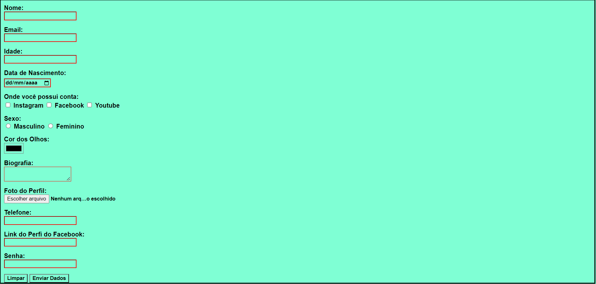

# Form in HTML + CSS

> Essa é a imagem do formulário em HTML estilizado com CSS que fizemos no CodeClub.

### Projeto já finalizado

O projeto já foi terminado e o único propósito é o treinamento com a linguagem de marcação HTML mais os estilos com CSS.

- [x] HTML semâmtico
- [x] Criação do HTML
- [x] Estilização com CSS

## ✍️ Criador:

O projeto foi desenvolvido por um aluno:

<table>
  <tr>
    <td align="center">
      <a href="#">
         
        
          <b>Arthur Amaral</b>
        
      </a>
    </td>
    